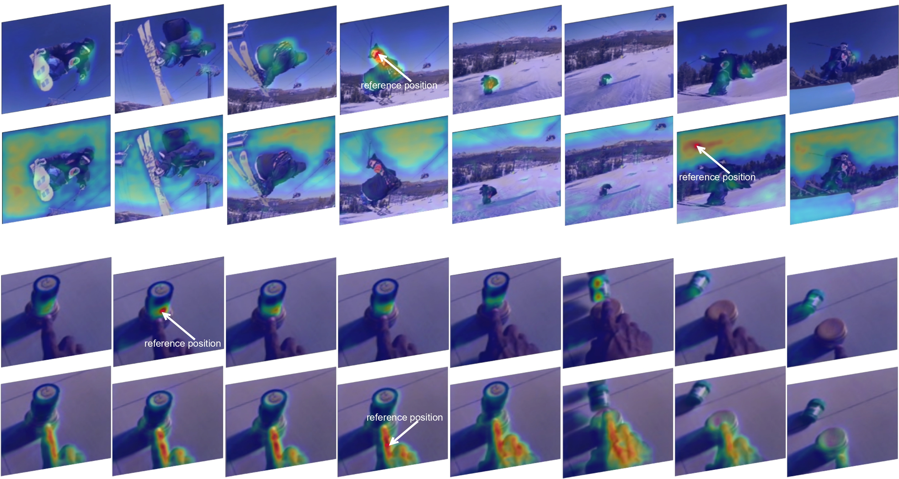

# Region-based Non-local operation for Video Classification [[arXiv]](https://arxiv.org/abs/2007.09033)

<div align="center">
    
</div>

## Citation

Please **[★star]** this repo and **[cite]** the following arXiv paper if you think our RNL is useful for you:

```
@article{huang2020region,
  title={Region-based Non-local Operation for Video Classification},
  author={Huang, Guoxi and Bors, Adrian G},
  journal={arXiv preprint arXiv:2007.09033},
  year={2020}
}
```

## Prerequisites
- [PyTorch](https://pytorch.org/) 1.3 or higher

## Data Preparation

Please refer to [TSM](https://github.com/mit-han-lab/temporal-shift-module) repo for the details of data preparation.


## Pretrained Models

The accuracy might be a bit different from the paper, as we did some modification to our models. For example, instead of using SE module reported in the paper, we use the Channel-gate module form [GCNet](https://github.com/xvjiarui/GCNet) to model the channel attention.

| method          | n-frame      | Kinetics Acc. | checkpoint |
| --------------- | ------------ | ------------- | ------------------------------------------------------------ |
| NL I3D-ResNet50 | 32 * 10clips | 74.9%         | -
| RNL TSM-ResNet50 | 8 * 10clips  | 75.6%     | [link](https://drive.google.com/file/d/1l1NAMYkjXf6yQAyJoMhPii9j050Wy8K2/view?usp=sharing) |
| RNL TSM-ResNet50 | 16 * 10clips  | 77.2%     | [link](https://drive.google.com/file/d/1Sb_aOIc-69w33Z2p_OF-aPoc1_m-u1gp/view?usp=sharing)
| RNL TSM-ResNet50 | (16+8) * 10clips  | 77.4%     | -

On Kinetics, RNL TSM models achieve better performance than NL I3D model with less computation (shorter video length).

| method          | n-frame      | Something-V1 Acc. | checkpoint |
| --------------- | ------------ | ------------- | -------------------------------------------------------------|
| RNL TSM-ResNet50 | 8 * 2clips  | 49.5%     | [link](https://drive.google.com/file/d/15t1rNgQEFs3dRu8FokhPV6zA6_SdtSU6/view?usp=sharing) |
| RNL TSM-ResNet50 | 16 * 2clips  | 51.0%     | [link](https://drive.google.com/file/d/1k6-v1qsWhrTaL8HuoLWRmUEYiyOuQbKe/view?usp=sharing)
| RNL TSM-ResNet50 | (8+16) * 2clips  | 52.7%     | -
| RNL TSM-ResNet101 | 8 * 2clips  | 50.8%     | [link](https://drive.google.com/file/d/1QIVxymMuqAq8A0-C7UPlT5Id8Ovv4xH9/view?usp=sharing)
| RNL 101 + RNL 50 | (8+16) * 2clips  | 54.1%  | -


## Training 

We provided several examples to train RNL network with this repo:

- To train on Kinetics from ImageNet pretrained models, you can run the script bellow:
 ```bash
python main.py --dataset kinetics  --dense_sample --dist-url 'tcp://localhost:6666' \
--dist-backend 'nccl' --multiprocessing-distributed --available_gpus 0,1,2,3 --world-size 1 \
--rank 0 --gd 20 --shift --shift_div=8 --shift_place=blockres --npb --lr 0.02 --wd 2e-4 \
--dropout 0.5 --num_segments 8 --batch_size 16 --batch_multiplier 4 --use_warmup --warmup_epochs 5 \
--lr_type cos --epochs 100 --non_local  --suffix 1

```

- To train on Something-Something V1 from ImageNet pretrained models, you can run the script bellow:
 ```bash
python main.py --dist-url 'tcp://localhost:6666' --dist-backend 'nccl' \
--multiprocessing-distributed --available_gpus 0,1,2,3 --world-size 1 --rank 0 \
--dataset something --gd 20 --shift --shift_div=8 --shift_place=blockres --npb \
--lr 0.02 --wd 1e-3 --dropout 0.8 --num_segments 8 --batch_size 16 --batch_multiplier 4\
--use_warmup --warmup_epochs 1 --lr_type cos --epochs 50 --non_local  --suffix 1

# Notice that the total batch size is equal to batch_size x batch_multiplier x world_size, and 
# you should scale up the learning rate with batch size. For example, if you use 
# a batch size of 128 you should set learning rate to 0.04.
  ```
  


## Test 

For example, to test the downloaded pretrained models, you can run the scripts below. The scripts test RNL on 8-frame setting by running:

```bash

# test on kinetics
python test_models.py kinetics  \
--weights=pretrained/TSM_kinetics_RGB_resnet50_shift8_blockres_avg_segment8_e100_cos_dense_nl_lr0.02_wd2.0e-04.pth.tar \
--test_segments=8 --batch_size=16 -j 25 --test_crops=3  --dense_sample --full_res

# test on Something
python test_models.py something \
--weights=pretrained/TSM_something_RGB_resnet50_shift8_blockres_avg_segment8_e50_cos_nl_h_8e-4.pth.tar \
--test_segments=8 --batch_size=2 -j 25 --test_crops=3  --twice_sample  --full_res

```

## Other Info

### References

This repository is built upon the following baseline implementations.

- [TSM](https://github.com/mit-han-lab/temporal-shift-module)
- [TSN](https://github.com/yjxiong/tsn-pytorch)


### Contact

For any questions, please feel free to open an issue or contact:

```
Guoxi Huang: gh825@york.ac.uk
```
